# Praktikum Jaringan Komputer 2023

**Kelompok IT08**

Nama Anggota Kelompok | NRP
------------------- | --------------		
Aqil Sulthan Yuki Maye | 5027211007
Adimas Defatra Bimasena | 5027211040

## Modul 2

## Daftar Soal :
- [Soal 1](#soal-1)
- [Soal 2](#soal-2)
- [Soal 3](#soal-3)
- [Soal 4](#soal-4)
- [Soal 5](#soal-5)
- [Soal 6](#soal-6)
- [Soal 7](#soal-7)
- [Soal 8](#soal-8)
- [Soal 9](#soal-9)
- [Soal 10](#soal-10)
- [Soal 11](#soal-11)
- [Soal 12](#soal-12)
- [Soal 13](#soal-13)
- [Soal 14](#soal-14)
- [Soal 15](#soal-15)
- [Soal 16](#soal-16)
- [Soal 17](#soal-17)
- [Soal 18](#soal-18)
- [Soal 19](#soal-19)
- [Soal 20](#soal-20)

---
### Soal 1
Yudhistira akan digunakan sebagai DNS Master, Werkudara sebagai DNS Slave, Arjuna merupakan Load Balancer yang terdiri dari beberapa Web Server yaitu Prabakusuma, Abimanyu, dan Wisanggeni.
- Penjelasan:

Konfigurasi topologi
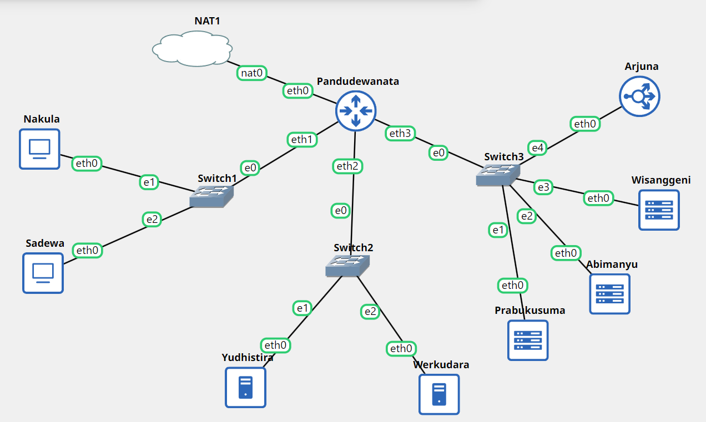

Yudhistira
```
auto eth0
iface eth0 inet static
	address 192.237.2.2
	netmask 255.255.255.0
	gateway 192.237.2.1
```

Werkudara
```
auto eth0
iface eth0 inet static
	address 192.237.2.3
	netmask 255.255.255.0
	gateway 192.237.2.1
```

Arjuna
```
auto eth0
iface eth0 inet static
	address 192.237.3.5
	netmask 255.255.255.0
	gateway 192.237.3.1
```

Prabakusuma
```
auto eth0
iface eth0 inet static
	address 192.237.3.2
	netmask 255.255.255.0
	gateway 192.237.3.1
```

Abimanyu
```
auto eth0
iface eth0 inet static
	address 192.237.3.3
	netmask 255.255.255.0
	gateway 192.237.3.1
```

Wisanggeni
```
auto eth0
iface eth0 inet static
	address 192.237.3.4
	netmask 255.255.255.0
	gateway 192.237.3.1
```

---
### Soal 2
Buatlah website utama pada node arjuna dengan akses ke arjuna.yyy.com dengan alias www.arjuna.yyy.com dengan yyy merupakan kode kelompok.
- Penjelasan:

Install package pada DNS Master
```
config() {
    if ! dpkg -l | grep -q bind9; then
        su -c "apt install sudo"
        sudo apt update
        sudo apt install -y sudo bind9 nano
    fi
}
```
Melakukan config zone arjuna `/etc/bin/named.conf.local` di DNS Master
```
zone "arjuna.it08.com" {
    type master;
    notify yes;
    also-notify { 192.237.2.3; };
    allow-transfer { 192.237.2.3; };
    file "/etc/bind/jarkom/arjuna.it08.com";
};
```
Membuat config `/etc/bind/jarkom/arjuna.it08.com`
```
\$TTL 604800
@ IN SOA arjuna.it08.com. root.arjuna.it08.com. (
    2   ; Serial
    604800      ; Refresh
    86400       ; Retry
    2419200     ; Expire
    604800 ); Negative Cache TTL
@ IN NS arjuna.it08.com.
@ IN A 192.237.3.5   ; IP address of your server
@ IN AAAA ::1
www in CNAME arjuna.it08.com.
```
Restart service Bind9 DNS Master terlebih dahulu
```
service bind9 restart
```
Test ping `arjuna.it08.com`
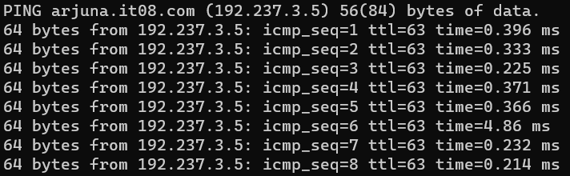

---
### Soal 3
Dengan cara yang sama seperti soal nomor 2, buatlah website utama dengan akses ke abimanyu.yyy.com dan alias www.abimanyu.yyy.com.
- Penjelasan:
Melakukan config zone arjuna `/etc/bin/named.conf.local` di DNS Master
```
zone "abimanyu.it08.com" {
    type master;
    notify yes;
    also-notify { 192.237.2.3; };
    allow-transfer { 192.237.2.3; };
    file "/etc/bind/jarkom/abimanyu.it08.com";
};
```
Membuat config `/etc/bind/jarkom/abimanyu.it08.com`
```
\$TTL 604800
@ IN SOA abimanyu.it08.com. root.abimanyu.it08.com. (
    2   ; Serial
    604800      ; Refresh
    86400       ; Retry
    2419200     ; Expire
    604800 ); Negative Cache TTL
@ IN NS abimanyu.it08.com.
@ IN A 192.237.3.3   ; IP address of your server
@ IN AAAA ::1
www in CNAME abimanyu.it08.com.
```
Restart service Bind9 DNS Master terlebih dahulu
```
service bind9 restart
```
Test ping `abimanyu.it08.com`
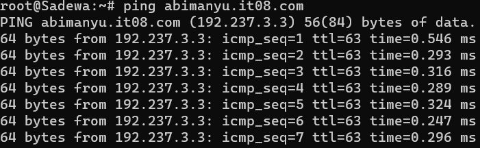

---
### Soal 4
Kemudian, karena terdapat beberapa web yang harus di-deploy, buatlah subdomain parikesit.abimanyu.yyy.com yang diatur DNS-nya di Yudhistira dan mengarah ke Abimanyu.
- Penjelasan:
Menambahkan config subdomain "parikesit" di `/etc/bind/jarkom/abimanyu.it08.com`
```
\$TTL 604800
@ IN SOA abimanyu.it08.com. root.abimanyu.it08.com. (
    2   ; Serial
    604800      ; Refresh
    86400       ; Retry
    2419200     ; Expire
    604800 ); Negative Cache TTL
@ IN NS abimanyu.it08.com.
@ IN A 192.237.3.3   ; IP address of your server
@ IN AAAA ::1
www in CNAME abimanyu.it08.com.
www.parikesit IN CNAME abimanyu.it08.com.
```
Restart service Bind9 DNS Master terlebih dahulu
```
service bind9 restart
```
Test ping `parikesit.abimanyu.it08.com`
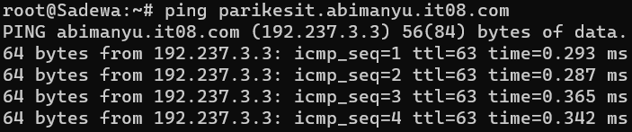

---
### Soal 5
Buat juga reverse domain untuk domain utama. (Abimanyu saja yang direverse)
- Penjelasan:
Menambahkan zone reverse DNS pada file /etc/bind/named.conf.local
```
zone "2.237.192.in-addr.arpa" {
    type master;
    file "/etc/bind/jarkom/2.237.192.in-addr.arpa";
};
```
Tambahkan reverse DNS (NS dan PTR) pada file `/etc/bind/jarkom/2.237.192.in-addr.arpa`
```
\$TTL 604800
@ IN SOA abimanyu.it08.com. root.abimanyu.it08.com. (
    72  ; Serial
    604800      ; Refresh
    86400       ; Retry
    2419200     ; Expire
    604800 ); Negative Cache TTL
2.237.192.in-addr.arpa. IN NS abimanyu.it08.com.
2 IN PTR abimanyu.com.
```
Restart service Bind9 DNS Master terlebih dahulu
```
service bind9 restart
```
Melakukan reverse lookup pada domain `abimanyu.it08.com`
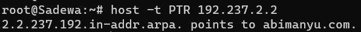

---
### Soal 6
Agar dapat tetap dihubungi ketika DNS Server Yudhistira bermasalah, buat juga Werkudara sebagai DNS Slave untuk domain utama.
- Penjelasan:
Install package pada DNS Slave
```
config() {
    if ! dpkg -l | grep -q bind9; then
        su -c "apt install sudo"
        sudo apt update
        sudo apt install -y sudo bind9 nano
    fi
}
```
Melakuan konfigurasi IP DNS Slave di `/etc/bind/named.conf.local` DNS Master
```
zone "arjuna.it08.com" {
    type master;
    notify yes;
    also-notify { 192.237.2.3; };
    allow-transfer { 192.237.2.3; };
    file "/etc/bind/jarkom/arjuna.it08.com";
};

zone "abimanyu.it08.com" {
    type master;
    notify yes;
    also-notify { 192.237.2.3; };
    allow-transfer { 192.237.2.3; };
    file "/etc/bind/jarkom/abimanyu.it08.com";
};
```
Melakukan konfigurasi `/etc/bind/named.conf.local` DNS Slave
```
zone "arjuna.it08.com" {
    type slave;
    masters { 192.237.2.2; };
    file "/var/lib/bind/arjuna.it08.com";
};

zone "abimanyu.it08.com" {
    type slave;
    masters { 192.237.2.2; };
    file "/var/lib/bind/abimanyu.it08.com";
};
```
Menghentikan service Bind9 DNS Master terlebih dahulu
```
service bind9 stop
```
Restart service Bind9 DNS Slave
```
service bind9 restart
```
Test ping dengan DNS Slave
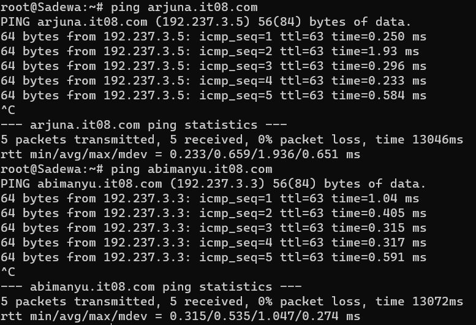

---
### Soal 7
Seperti yang kita tahu karena banyak sekali informasi yang harus diterima, buatlah subdomain khusus untuk perang yaitu baratayuda.abimanyu.yyy.com dengan alias www.baratayuda.abimanyu.yyy.com yang didelegasikan dari Yudhistira ke Werkudara dengan IP menuju ke Abimanyu dalam folder Baratayuda.
- Penjelasan:

Melakukan konfigurasi abimanyu agar bisa mendelegasikan subdomain ke DNS Slave di `/etc/bind/baratayuda/baratayuda.abimanyu.it08.com` DNS Master
```
\$TTL 604800
@ IN SOA abimanyu.it08.com. root.abimanyu.it08.com. (
    2   ; Serial
    604800      ; Refresh
    86400       ; Retry
    2419200     ; Expire
    604800 ); Negative Cache TTL
@ IN NS abimanyu.it08.com.
@ IN A 192.237.3.3   ; IP address of your server
@ IN AAAA ::1
www in CNAME abimanyu.it08.com.
parikesit IN CNAME abimanyu.it08.com.
www.parikesit IN CNAME abimanyu.it08.com.
ns1 IN A 192.237.2.3
baratayuda IN NS ns1
```
Selanjutnya edit file `/etc/bind/named.conf.options` DNS Master dengan query berikut
```
allow-query{any;};
```
Restart service Bind9 DNS Master
```
service bind9 restart
```
Melakukan konfigurasi baratayuda di `/etc/bind/named.conf.local` DNS Slave
```
zone "baratayuda.abimanyu.it08.com" {
    type master;
    file "/etc/bind/baratayuda/baratayuda.abimanyu.it08.com";
};
```
Edit file `/etc/bind/named.conf.local` DNS Slave
```
zone "abimanyu.it08.com" {
    type slave;
    masters { 192.237.2.2; };
    file "/var/lib/bind/abimanyu.it08.com";
};
``` 
Melakukan konfigurasi pada `etc/bind/baratayuda/baratayuda.it08.com` di DNS Slave
```
\$TTL 604800
@ IN SOA baratayuda.abimanyu.it08.com. root.baratayuda.abimanyu.it08.com. (
    2   ; Serial
    604800      ; Refresh
    86400       ; Retry
    2419200     ; Expire
    604800 ); Negative Cache TTL
;
@ IN NS baratayuda.abimanyu.it08.com.
@ IN A 192.237.2.3
www IN CNAME baratayuda.abimanyu.it08.com.
```
Selanjutnya pada node DNS Slave edit file `/etc/bind/named.conf.options`
```
allow-query{any;};
```
Test ping baratayuda.abimanyu.it08.com
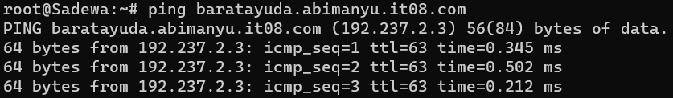

---
### Soal 8
Untuk informasi yang lebih spesifik mengenai Ranjapan Baratayuda, buatlah subdomain melalui Werkudara dengan akses rjp.baratayuda.abimanyu.yyy.com dengan alias www.rjp.baratayuda.abimanyu.yyy.com yang mengarah ke Abimanyu.
- Penjelasan:
Menambahkan konfigurasi domain rjp di `/etc/bind/baratayuda/baratayuda.abimanyu.it08.com` DNS slave
```
\$TTL 604800
@ IN SOA baratayuda.abimanyu.it08.com. root.baratayuda.abimanyu.it08.com. (
    2   ; Serial
    604800      ; Refresh
    86400       ; Retry
    2419200     ; Expire
    604800 ); Negative Cache TTL
;
@ IN NS baratayuda.abimanyu.it08.com.
@ IN A 192.237.2.3
www IN CNAME baratayuda.abimanyu.it08.com.
rjp IN A 192.237.2.3
www.rjp IN A 192.237.2.3
```
Restart service Bind9 DNS Master
```
service bind9 restart
```
Test ping rjp.baratayuda.abimanyu.it08.com
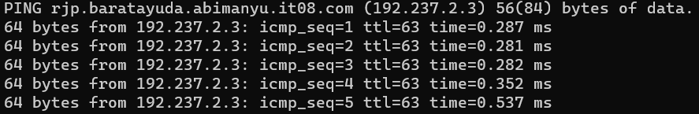

---
### Soal 9
Arjuna merupakan suatu Load Balancer Nginx dengan tiga worker (yang juga menggunakan nginx sebagai webserver) yaitu Prabakusuma, Abimanyu, dan Wisanggeni. Lakukan deployment pada masing-masing worker.
- Penjelasan:
Install package load balancer yang diperlukan
```
if ! dpkg -l | grep -q nginx; then
        apt-get install -y nginx
    fi

    if ! dpkg -l | grep -q php-fpm; then
        apt-get install -y php-fpm
    fi

    if ! dpkg -l | grep -q wget; then
        apt-get install -y wget
    fi

    if ! dpkg -l | grep -q unzip; then
        apt-get install -y unzip
    fi
```
Menginsstal resources yang diperlukan
 ```
apt-get update && apt install nginx php php-fpm -y

wget -O '/var/www/arjuna.it08.com.zip' 'https://drive.usercontent.google.com/download?id=17tAM_XDKYWDvF-JJix1x7txvTBEax7vX'

unzip /var/www/arjuna.it08.com.zip -d /var/www/

mv /var/www/arjuna.yyy.com /var/www/arjuna.it08

rm /var/www/arjuna.it08.com.zip
 ```

 Setup nginx pada masing-masing webserver di `/etc/nginx/sites-available/arjuna`
 ```
    server {

	listen [8001/8002/8003];

	root /var/www/arjuna.it08;

	index index.php index.html index.htm;
	server_name _;

	location / {
			try_files $uri $uri/ /index.php?$query_string;
	}

	# pass PHP scripts to FastCGI server
	location ~ \.php$ {
	include snippets/fastcgi-php.conf;
	fastcgi_pass unix:/run/php/php7.0-fpm.sock;
	}

location ~ /\.ht {
			deny all;
	}

	error_log /var/log/nginx/jarkom_error.log;
	access_log /var/log/nginx/jarkom_access.log;
}
 ```
Melakukan symlink dan memulai ulang service yang diperlukan
```
ln -s /etc/nginx/sites-available/arjuna /etc/nginx/sites-enabled
rm /etc/nginx/site-enabled/default
service nginx restart
```
Akses web masing-masing webserver di `lynx 192.237.3.2:8001`, `lynx 192.237.3.3:8002`, dan `lynx 192.237.3.4:8003`
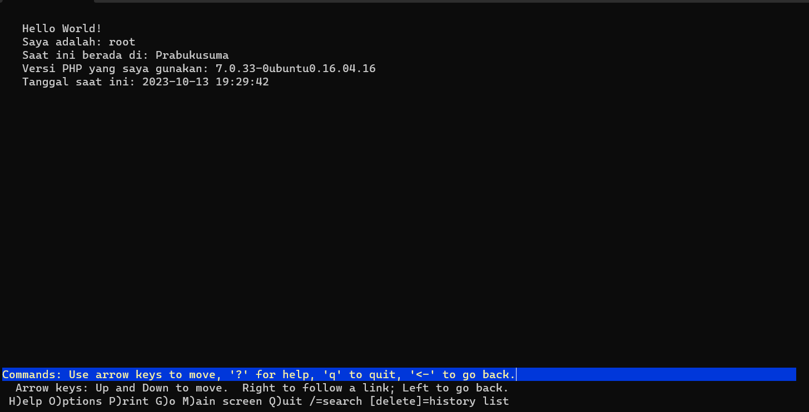
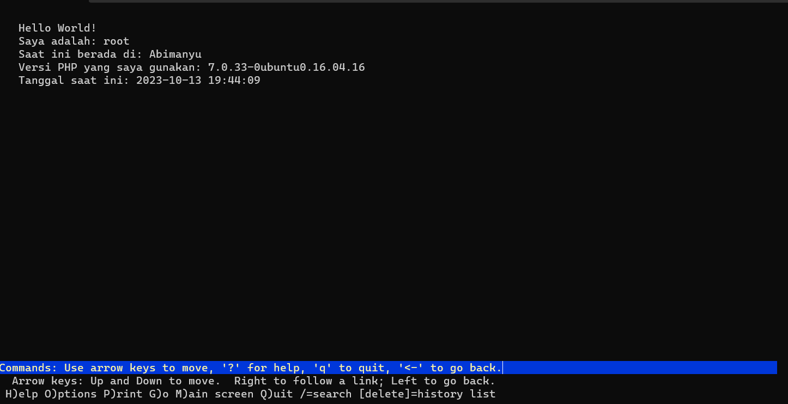
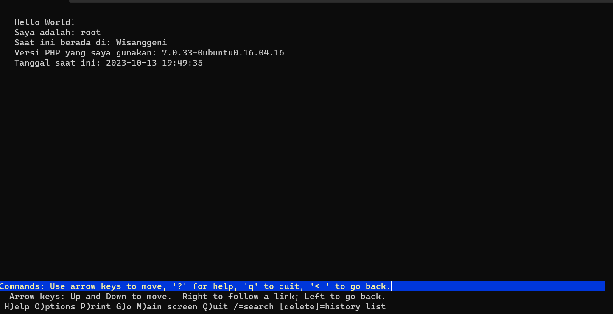

---
### Soal 10
Kemudian gunakan algoritma Round Robin untuk Load Balancer pada Arjuna. Gunakan server_name pada soal nomor 1. Untuk melakukan pengecekan akses alamat web tersebut kemudian pastikan worker yang digunakan untuk menangani permintaan akan berganti ganti secara acak. Untuk webserver di masing-masing worker wajib berjalan di port 8001-8003. Contoh
    - Prabakusuma:8001
    - Abimanyu:8002
    - Wisanggeni:8003
- Penjelasan:
Melakukan setup nginx pada load balancer dengan algoritma Round Robin di `/etc/nginx/sites-available/lb-arjuna`
```
upstream myweb  {
        server 192.237.3.2:8001; #IP PrabukusumaWebServer
        server 192.237.3.3:8002; #IP AbimanyuWebServer
        server 192.237.3.4:8003; #IP WisanggeniWebServer
}

server {
        listen 80;
        server_name arjuna.it08.com;

        location / {
        proxy_pass http://myweb;
        }
}
```
Melakukan symlink dan restart resources yang dibutuhkan
```
echo "$conf" > /etc/nginx/sites-available/lb-arjuna

ln -s /etc/nginx/sites-available/lb-arjuna /etc/nginx/sites-enabled

service nginx restart
service php7.0-fpm start
```
Cek apakah load balancer sudah berjalan dengan baik dengan mengetik command `lynx abimanyu.it08.com`
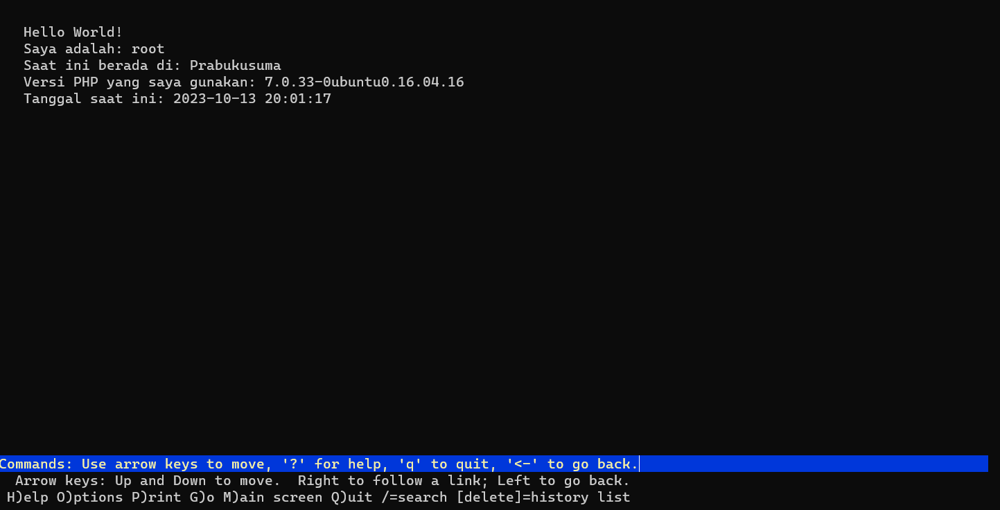

---
### Soal 11
Selain menggunakan Nginx, lakukan konfigurasi Apache Web Server pada worker Abimanyu dengan web server www.abimanyu.yyy.com. Pertama dibutuhkan web server dengan DocumentRoot pada /var/www/abimanyu.yyy
- Penjelasan:
Install packages yang diperlukan 
```
apt-get install apache2
service apache2 start
```
Tambahan konfigurasi berikut di `etc/apache2/sites-available/000-default.conf`
```
<VirtualHost *:80>
    ServerAdmin webmaster@localhost
    DocumentRoot /var/www/abimanyu.it08
    ServerName abimanyu.it08.com
    ServerAlias www.abimanyu.it08.com
    <Directory /var/www/abimanyu.it08>
        Options +Indexes
    </Directory>
    ErrorLog ${APACHE_LOG_DIR}/error.log
    CustomLog ${APACHE_LOG_DIR}/access.log combined
</VirtualHost>
```
Restart Apache2 dengan `service apache2 restart` dan jalankan `abimanyu.it08.com` di lynx
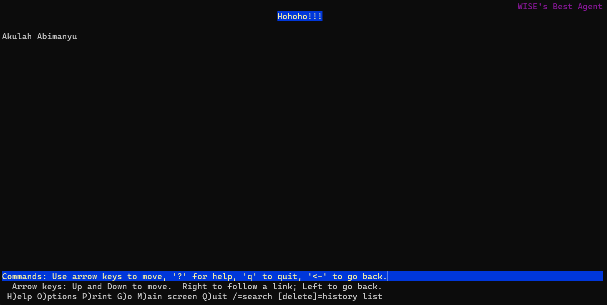

---
### Soal 12
Setelah itu ubahlah agar url www.abimanyu.yyy.com/index.php/home menjadi www.abimanyu.yyy.com/home.
- Penjelasan:
Tambahkan alias pada `/etc/apache2/sites-available/000-default.conf` sebagai berikut
```
<VirtualHost *:80>
    ServerAdmin webmaster@localhost
    DocumentRoot /var/www/jarkom
    ServerName abimanyu.it08.com
    ServerAlias www.abimanyu.it08.com
    <Directory /var/www/abimanyu>
        Options +Indexes
    </Directory>
    Alias "/home" "/var/www/jarkom/index.php/home"
    ErrorLog ${APACHE_LOG_DIR}/error.log
    CustomLog ${APACHE_LOG_DIR}/access.log combined
</VirtualHost>
```
Restart Apache2 dengan `service apache2 restart` dan jalankan `abimanyu.it08.com/home` di lynx


---
### Soal 13
Selain itu, pada subdomain www.parikesit.abimanyu.yyy.com, DocumentRoot disimpan pada /var/www/parikesit.abimanyu.yyy
- Penjelasan

Masukkan konfigurasi untuk website pada /etc/apache2/sites-available/parikesit.abimanyu.it08.conf
```
echo ' <VirtualHost *:80>
    ServerAdmin webmaster@localhost
    DocumentRoot /var/www/parikesit.abimanyu.it08
    ServerName parikesit.abimanyu.it08.com
    ServerAlias www.parikesit.abimanyu.it08.com
    <Directory /var/www/parikesit.abimanyu.it08/public>
   Options +Indexes
</Directory>

    ErrorLog ${APACHE_LOG_DIR}/error.log
    CustomLog ${APACHE_LOG_DIR}/access.log combined
</VirtualHost>
```
Menjalankan kode beriut untuk medownload resources
```
cd /var/www

wget --no-check-certificate 'https://docs.google.com/uc?export=download&id=1LdbYntiYVF_NVNgJis1GLCLPEGyIOreS' -O parikesit.zip

unzip parikesit.zip -d parikesit.abimanyu.it08

rm parikesit.zip

mv parikesit.abimanyu.it08/parikesit.abimanyu.yyy.com/* parikesit.abimanyu.it08

rmdir parikesit.abimanyu.it08/parikesit.abimanyu.yyy.com
mkdir parikesit.abimanyu.it08.com/secret
systemctl restart apache2
```
Jalankan `lynx http://www.parikesit.abimanyu.it08.com`di lynx untuk melihat hasilnya
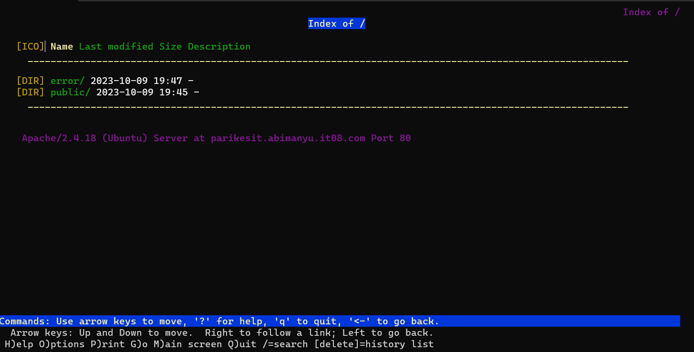


---
### Soal 14
Pada subdomain tersebut folder /public hanya dapat melakukan directory listing sedangkan pada folder /secret tidak dapat diakses (403 Forbidden).

- Penjelasan

Masukkan konfigurasi berikut pada `/etc/apache2/sites-available/parikesit.abimanyu.it08.conf`
```
<Directory /var/www/parikesit.abimanyu.it08/public>
   Options +Indexes
</Directory>

<Directory /var/www/parikesit.abimanyu.it08/secret>
   Options -Indexes
</Directory>
```
Kemudian cek hasilnya melalui link `lynx http://www.parikesit.abimanyu.it08.com/public` dan `lynx http://www.parikesit.abimanyu.it08.com/secret`
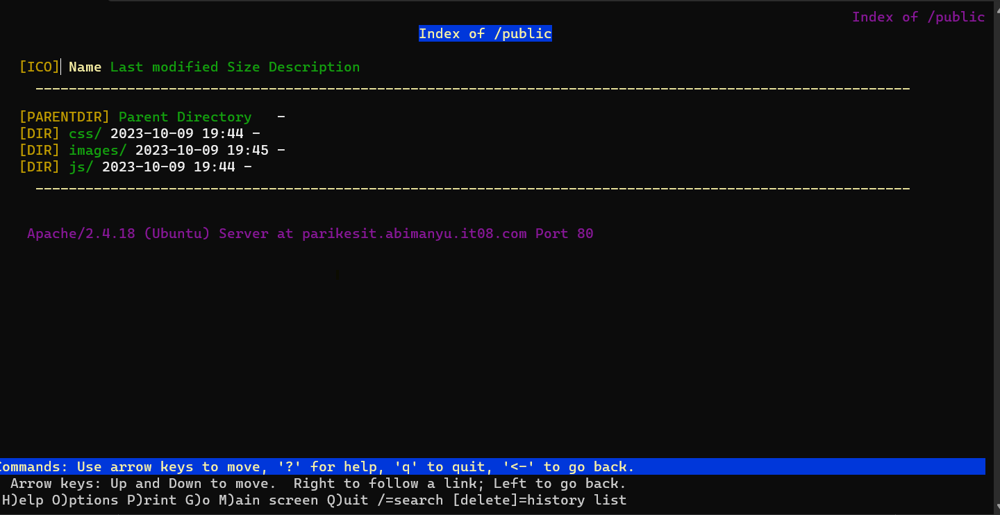
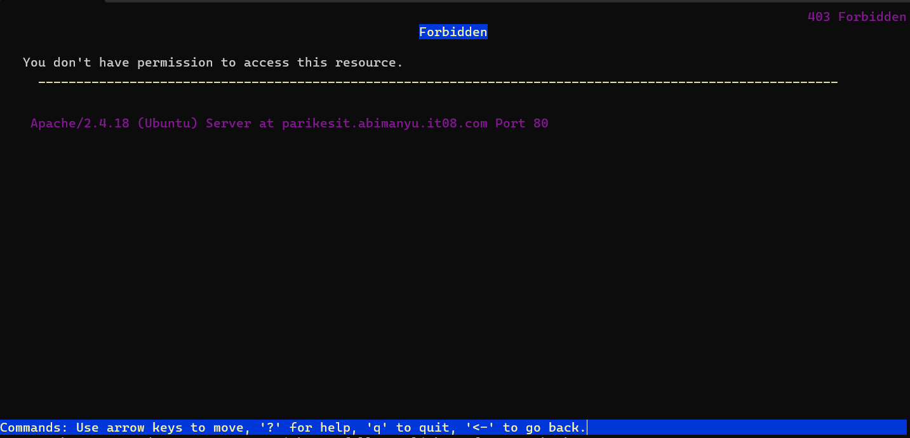

---
### Soal 15
Buatlah kustomisasi halaman error pada folder /error untuk mengganti error kode pada Apache. Error kode yang perlu diganti adalah 404 Not Found dan 403 Forbidden.

- Penjelasan

Masukkan konfigurasi berikut pada `/etc/apache2/sites-available/parikesit.abimanyu.it08.conf`
```
ErrorDocument 404 /error/404.html
ErrorDocument 403 /error/403.html
```
Kemudian cek hasilnya melalui link `lynx http://www.parikesit.abimanyu.it08.com/secret`


Lalu jika kita mengakses link `lynx http://www.parikesit.abimanyu.it08.com/[randomquery]`, maka akan menampilkan halaman seperti berikut
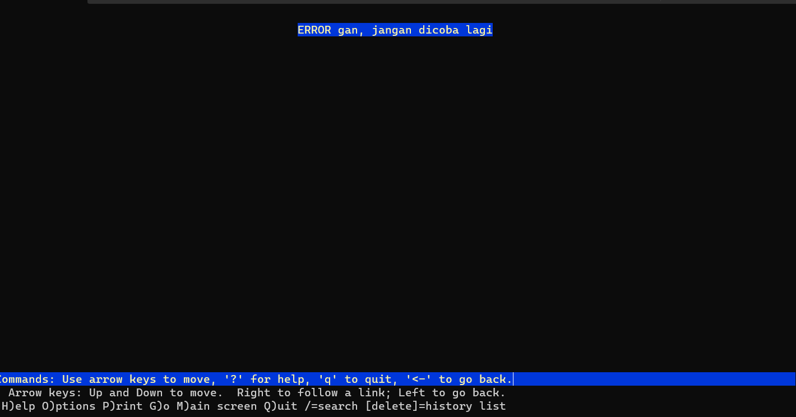

---
### Soal 16
Buatlah suatu konfigurasi virtual host agar file asset www.parikesit.abimanyu.yyy.com/public/js menjadi 
www.parikesit.abimanyu.yyy.com/js 

- Penjelasan

Masukkan konfigurasi berikut pada `/etc/apache2/sites-available/parikesit.abimanyu.it08.conf`
```
Alias /js /var/www/parikesit.abimanyu.it08/public/js

RewriteEngine On
```
Lalu jalankan command berikut
```
service apache2 restart
```
Kemudian cek hasilnya melalui link `lynx http://www.parikesit.abimanyu.it08.com/js`
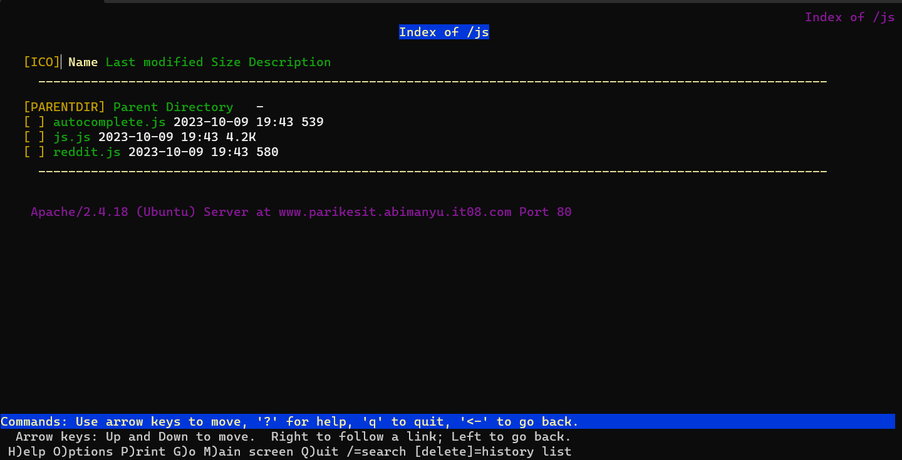

---
### Soal 17
Agar aman, buatlah konfigurasi agar www.rjp.baratayuda.abimanyu.yyy.com hanya dapat diakses melalui port 14000 dan 14400.
- Penjelasan

Masukkan konfigurasi berikut pada `/etc/apache2/sites-available/rjp.baratayuda.abimanyu.it08.conf` dengan port virtualhost *:14000 *:14400
```
<conf="<VirtualHost *:14000 *:14400>
    ServerAdmin webmaster@localhost
    DocumentRoot /var/www/rjp.baratayuda.abimanyu.it08
    ServerName rjp.baratayuda.abimanyu.it08.com
    ServerAlias www.rjp.baratayuda.abimanyu.it08.com

    ErrorLog \${APACHE_LOG_DIR}/error.log
    CustomLog \${APACHE_LOG_DIR}/access.log combined
</VirtualHost>"
```
Masukkan konfigurasi port pada `/etc/apache2/ports.conf`
```
Listen 80
Listen 14000
Listen 14400

<IfModule ssl_module>
        Listen 443
</IfModule>

<IfModule mod_gnutls.c>
        Listen 443
</IfModule>

# vim: syntax=apache ts=4 sw=4 sts=4 sr noet
```
Akibatnya, jika kita hanya mengakses `lynx http://www.rjp.baratayuda.abimanyu.it08.com`, maka tampilannya akan menjadi berikut


Kita harus memasukkan alamt yang lebih spesifik dengan menambahkan `:port` dibelakangnya seperti `lynx http://www.rjp.baratayuda.abimanyu.it08.com:14000` dan `lynx http://www.rjp.baratayuda.abimanyu.it08.com:14400`


---
### Soal 18
Untuk mengaksesnya buatlah autentikasi username berupa “Wayang” dan password “baratayudayyy” dengan yyy merupakan kode kelompok. Letakkan DocumentRoot pada /var/www/rjp.baratayuda.abimanyu.yyy.

- Penjelasan

Tambahkan konfigurasi untuk website pada /etc/apache2/sites-available/rjp.baratayuda.abimanyu.it08.conf
```
<Directory "/var/www/rjp.baratayuda.abimanyu.it08">
        Options +FollowSymLinks -Multiviews
        AllowOverride All
        AuthType Basic
        AuthName "Restricted Content"
        AuthUserFile /etc/apache2/.htpasswd
        Require valid-user
    </Directory>
```
Jalankan perintah berikut pada terminal untuk melakukan konfigurasi autentikasi
```
cd /etc/apache2/sites-available/
htpasswd -c /etc/apache2/.htpasswd Wayang
a2dissite 
a2ensite rjp.baratayuda.abimanyu.it08.conf
service apache2 reload
service apache2 start
service apache2 status
```
Maka ketika kita mengakses lynx http://www.rjp.baratayuda.abimanyu.it08.com:14000 atau lynx http://www.rjp.baratayuda.abimanyu.it08.com:14400 akan ditunjukkan halaman autentifikasi user dan masukkan password yang sudah ditentukan (baratayudait08)


---
### Soal 19
Buatlah agar setiap kali mengakses IP dari Abimanyu akan secara otomatis dialihkan ke www.abimanyu.yyy.com (alias)

- Penjelasan

Tambahkan kode beikut pada /etc/apache2/sites-available/abimanyu.it08.conf

```
ServerAlias 192.237.3.3
```

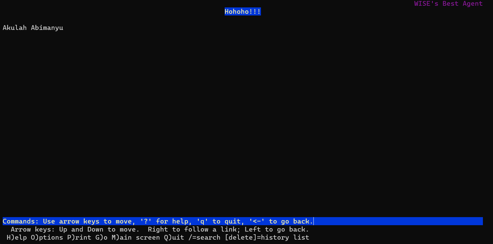

---
### Soal 20
Karena website www.parikesit.abimanyu.yyy.com semakin banyak pengunjung dan banyak gambar gambar random, maka ubahlah request gambar yang memiliki substring “abimanyu” akan diarahkan menuju abimanyu.png.

- Penjelasan

Menambahkan konfigurasi berikut ke `parikesit.abimanyu.it08.conf`
```
<Directory /var/www/parikesit.abimanyu.it08>
	Options +FollowSymLinks -Multiviews
	AllowOverride All
</Directory>
```
Menambahkan konfigurasi rewritecond ke `/etc/apache2/sites-available/parikesit.abimanyu.it08.conf`
```
RewriteCond %{REQUEST_URI} abimanyu
RewriteCond %{REQUEST_URI} \.(jpg|jpeg|png|gif)$
RewriteCond %{REQUEST_URI} !/public/images/abimanyu.png

RewriteRule ^(.*)$ /public/images/abimanyu.png [R=301,L]'
```
Maka ketika mengakses link `lynx http://www.parikesit.abimanyu.it08.com/public/images/abimanyu.png` bahkan `lynx http://www.parikesit.abimanyu.it08.com/public/images/abimanyunihbos.png` akan menampilkan tampilan yang meminta persetujuan untuk mendownload file png dimana file tersebut merupakan file abimanyu.png


